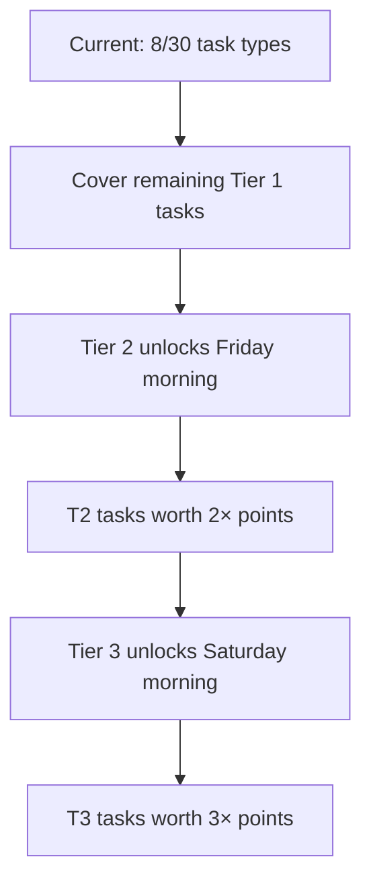
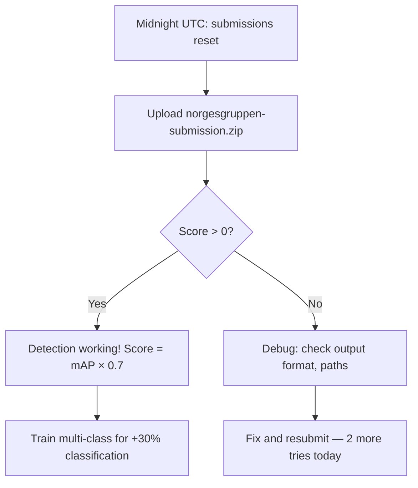

# Competition Plan — 66 Hours Remaining

## Current Standing (19:45 CET, March 19)

| Task | Our Score | #1 Score | Gap | Status |
|------|-----------|----------|-----|--------|
| Tripletex | 47.4 | 100.0 (Make No Mistakes) | -52.6 | Active, iClaw-E pushing |
| NorgesGruppen | --- | --- | N/A | Model trained, upload at 01:00 |
| Astar Island | --- | --- | N/A | Round 1 submitted, not scored yet |
| **Overall** | **14.9 (#6)** | **33.3 (#1)** | **-18.4** | |

## Scoring Math

```
Overall = (Tripletex_normalized + Detection_normalized + Astar_normalized) / 3
```

Each task normalized 0-100 by dividing by highest score. Currently only Tripletex is scoring.

## Priority-Ordered Plan

### Priority 1: Tripletex (biggest impact NOW)

**Owner:** iClaw-E
**Current:** 47.4/100 (8/30 task types, score 5.60)
**Target:** 70+ by end of Friday



**Scoring breakdown:**
- 30 task types, best-per-type kept forever
- T1 max: 2.0 per task (1.0 correctness × 1 tier × 2 efficiency)
- T2 max: 4.0 per task (unlocks Friday)
- T3 max: 6.0 per task (unlocks Saturday)
- Bad runs never lower score — submit aggressively

**Action items:**
1. Keep submitting to cover more task types
2. Fix field completeness for partial scores (e.g. missing `number` on products)
3. Parse Tripletex error messages for single-retry corrections
4. Minimize API calls for efficiency bonus (only on perfect correctness)
5. Prepare for T2/T3 — multi-step workflows (invoice+payment, credit notes)

**Key API patterns:**
| Pattern | Example | Flow |
|---------|---------|------|
| Single Entity | Create employee | POST /employee |
| With Linking | Invoice for customer | GET /customer → POST /order → POST /invoice |
| Modification | Add phone to contact | GET /customer → PUT /customer/{id} |
| Multi-Step | Register payment | POST /customer → POST /invoice → POST /payment |

### Priority 2: NorgesGruppen Detection (submit at midnight)

**Owner:** Claude-5
**Current:** Not scored (0/3 submissions today)
**Target:** 0.50+ detection mAP

**Model ready:** YOLOv8n single-class, mAP50=0.82 on val set
**Zip ready:** `norgesgruppen-submission.zip` (11MB)
**Submit at:** 01:00 CET (midnight UTC)



**Scoring:**
- Score = 0.7 × detection_mAP + 0.3 × classification_mAP
- Detection-only (category_id=0) caps at 0.70
- 3 submissions/day, resets midnight UTC
- Our model detects ~120 products per image with 0.72-0.93 confidence

**Next steps after first submission:**
1. Check mAP score
2. If good: train multi-class model (YOLOv8m, 356 categories)
3. If bad: debug output format, check bbox coordinate system

### Priority 3: Astar Island (when rounds appear)

**Owner:** Claude-5
**Current:** Round 1 submitted (priors-only, 0 queries left)
**Target:** 60+ score on future rounds

**Poller running** — auto-submits when new round appears.

**Improved model for Round 2:**
- Adjacency-aware priors (ocean 98%, settlements context-dependent)
- Frequency-based observations (multiple queries per area)
- Initial grid analysis (free, no query cost)

**Scoring:**
- entropy-weighted KL divergence
- Only dynamic cells matter (settlements, ruins, plains near settlements)
- Static cells (ocean, mountain) contribute ~0 to score
- Never use probability 0.0 — floor at 0.01

**Round schedule:** Unknown — admin-created. Round 1 lasted ~3 hours.

## Timeline

| When | Action |
|------|--------|
| Now - 01:00 | iClaw-E: Tripletex submissions. Claude-5: monitor, research |
| 01:00 CET | Stig uploads NorgesGruppen zip |
| 01:00 - morning | Check NorgesGruppen score, iterate if needed |
| Friday morning | Tier 2 Tripletex tasks unlock — 2× multiplier |
| Friday | Astar Island rounds (hopefully). Optimize detection model |
| Saturday morning | Tier 3 Tripletex tasks unlock — 3× multiplier |
| Saturday | Final push — optimize weakest task |
| Sunday 15:00 CET | **DEADLINE** — submit repo URL, ensure all scores final |

## Risk Register

| Risk | Impact | Mitigation |
|------|--------|------------|
| Astar Island never starts | 0/100 on 33% of score | Can't control — focus on other 2 tasks |
| NorgesGruppen model fails | 0/100 on 33% of score | 3 tries/day, debug output format |
| iClaw-E session dies | Tripletex stalls | STATUS.md has full context for recovery |
| Platform goes down | Lost time | Build locally, submit when back |
| Tier 2/3 tasks too hard | Score plateaus | Focus on getting more T1 tasks perfect first |

## Score Projections

| Scenario | Tripletex | Detection | Astar | Overall |
|----------|-----------|-----------|-------|---------|
| Current | 47 | 0 | 0 | 15.7 |
| Optimistic | 80 | 50 | 60 | 63.3 |
| Realistic | 65 | 35 | 40 | 46.7 |
| Pessimistic | 50 | 20 | 0 | 23.3 |

Top 3 requires ~60+ overall. We need strong scores on all 3 tasks.
