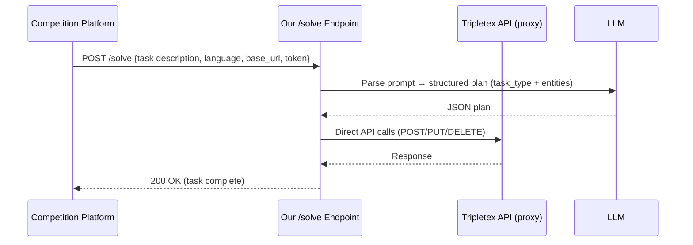

# Task 2: Tripletex — AI Accounting Agent

**Status:** In progress (banned — pending review by organizers)
**Owner:** iClaw-E (Mac Mini M2)
**Submission:** HTTPS API endpoint (`/solve`)
**Live endpoint:** `https://revenue-gale-lou-manor.trycloudflare.com/solve`

## Overview

Build an AI agent that receives accounting tasks in 1 of 7 languages (NO, EN, ES, PT, NN, DE, FR) and completes them by calling the Tripletex API via proxy.

## Key Details

- 30 task types total (10 per tier)
- Tier 1: available now | Tier 2: unlocks Friday | Tier 3: unlocks Saturday
- 5 minute timeout per task
- Score: field-by-field correctness × tier multiplier (T1=×1, T2=×2, T3=×3) + efficiency bonus on perfect scores
- Max per task: T1=2.0, T2=4.0, T3=6.0 (with 100% correctness + minimal API calls)
- **Best score per task is kept forever — bad runs never lower score**
- 5 submissions per task type per day, 3 concurrent
- Submit endpoint URL at: `app.ainm.no/submit/tripletex`

## Architecture



## Handlers (Tier 1 — 10 task types)

| Task type | Status | Notes |
|-----------|--------|-------|
| create_department | ✅ Scoring ~100% | Minimal body, works reliably |
| create_project | ✅ Scoring ~100% | PM lookup by name |
| create_supplier | ✅ Scoring ~86% | Address + org number |
| create_customer | ✅ Scoring ~63% | Address mapping needs work |
| create_product | ✅ Scoring | Unit price + product number |
| create_invoice | ✅ Fixed | Was broken (0/7) — now uses orders[] ref |
| create_employee | ✅ Fixed | Was 422 — removed invalid `administrator` field, now uses entitlements API for ALL_PRIVILEGES |
| create_travel_expense | ✅ Handler exists | Untested in competition |
| delete_travel_expense | ✅ Handler exists | Untested in competition |
| register_payment | ✅ Handler exists | Untested in competition |

## Key Fixes Applied

### `create_employee` (2026-03-19)
- **Bug:** Sent `administrator: true` — not a valid Tripletex API field → 422 on all attempts
- **Fix:** 
  1. Use `userType: "EXTENDED"` on POST (enables all entitlements)
  2. After creation: `PUT /employee/entitlement/:grantEntitlementsByTemplate?employeeId={id}&template=ALL_PRIVILEGES`
- **Impact:** Administrator role worth 5/10 pts per employee task — previously scoring 0

### `create_invoice` (2026-03-18)
- **Bug:** Invoice POST missing `orders: [{id: ...}]` reference
- **Fix:** Added order reference + correct field mapping

## Scores

| Date | Score | Rank | Notes |
|------|-------|------|-------|
| 2026-03-19 18:30 | 0 | — | Kickoff |
| 2026-03-19 ~20:30 | 47.4 | ~#9 | Peak before ban |
| 2026-03-19 ~21:00 | 38.3 | — | 12h benchmark recalibration |
| 2026-03-19 ~21:00 | 44.8 | #6 | Recalibrated up |
| 2026-03-19 21:20+ | 44.8 | #14 | Frozen — ban active |

## Ban History

- **Cause:** ~30 rapid test submissions in 1 hour while debugging tunnel (auto-ban threshold)
- **Status:** Under organizer review (Mikael, Astar)
- **Appeal:** Sent via competition Slack

## Server Setup

```bash
# Start server (from repo root)
cd task2 && bash run_server.sh

# Or manually:
source .venv/bin/activate
uvicorn task2.solution:app --host 127.0.0.1 --port 9001
cloudflared tunnel --url http://127.0.0.1:9001
```

## TODO (when ban lifts)

- [ ] Submit with new employee fix — should unlock 1-2 task types
- [ ] Submit with invoice fix — verify order ref works
- [ ] Cover all 10 Tier 1 types before T2 unlocks Friday
- [ ] Prepare for Tier 2 (multi-step workflows: invoice+payment, credit notes, project billing)
