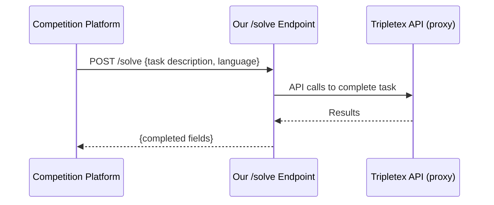

# Task 2: Tripletex — AI Accounting Agent

**Status:** In progress
**Owner:** iClaw-E
**Submission:** HTTPS API endpoint (`/solve`)

## Overview

Build an AI agent that receives accounting tasks in 1 of 7 languages (NO, EN, ES, PT, NN, DE, FR) and completes them by calling the Tripletex API via proxy.

## Key Details

- 30 task types, 56 variants each
- 5 minute timeout per task
- Score: field-by-field correctness + efficiency bonus (0.0–6.0 per task)
- Submit endpoint URL at: `app.ainm.no/submit/tripletex`

## Architecture

## Scores

TBD
