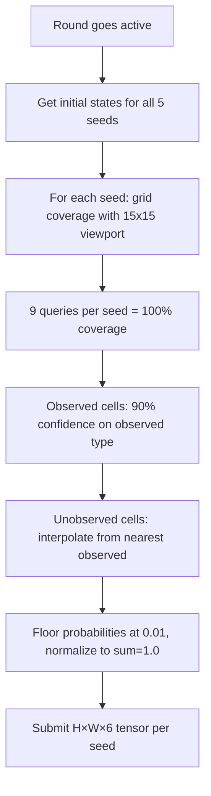

# Task 3: Astar Island — Norse World Prediction

**Status:** Submitted Round 1, awaiting score
**Owner:** Claude-5
**Submission:** REST API predictions

## Overview

Observe a black-box Norse civilisation simulator through a 15×15 viewport on a 40×40 map. Predict probability distributions of terrain types across the full map.

## Key Details

- 50 queries per round across 5 seeds (10 per seed)
- Map is 40×40, viewport is 5-15 cells wide
- 6 terrain classes: Empty(0), Settlement(1), Port(2), Ruin(3), Forest(4), Mountain(5)
- Raw grid values: 0=Empty, 1=Settlement, 2=Port, 3=Ruin, 4=Forest, 5=Mountain, 10=Ocean, 11=Plains
- Scored by entropy-weighted KL divergence (100 = perfect)
- Initial map states provided for free (no query cost)
- Simulation is stochastic — same map produces different outcomes each run
- **Never use probability 0.0** — floor at 0.01 to avoid infinite KL divergence

## Architecture



## Current Approach

1. **Grid coverage** — 9 queries at positions (0,0), (15,0), (25,0), (0,15), (15,15), (25,15), (0,25), (15,25), (25,25) = 100% map coverage per seed
2. **Observed cells** — 90% confidence on observed terrain type, 0.01 on others
3. **Unobserved cells** — distance-weighted interpolation from nearest observed cell
4. **Auto-polling** — `--poll` flag waits for active round, then submits automatically

## Scoring Formula

```
weighted_kl = Σ entropy(cell) × KL(truth || prediction) / Σ entropy(cell)
score = max(0, min(100, 100 × exp(-3 × weighted_kl)))
```

Static cells (ocean, mountain) have near-zero entropy and don't affect score. Only dynamic cells (settlements that grow/die, forests that change) matter.

## Scores

| Round | Status | Seeds | Score | Rank |
|-------|--------|-------|-------|------|
| 1 | Submitted, awaiting score | 5/5 | TBD | TBD |

## Improvement Ideas

- Use initial grid to set stronger priors (ocean=98% empty, mountain=95%)
- Run multiple queries per cell position to build frequency distributions
- Learn simulation rules from observation patterns
- Prioritize queries on dynamic cells (near settlements) over static ones
