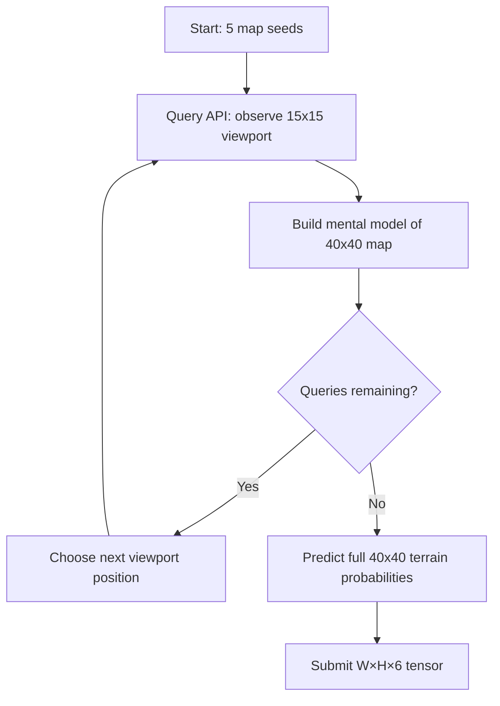

# Task 3: Astar Island — Norse World Prediction

**Status:** In progress
**Owner:** Claude-5
**Submission:** REST API predictions

## Overview

Observe a black-box Norse civilisation simulator through a 15×15 viewport on a 40×40 map. Make predictions about terrain types across the full map.

## Key Details

- 50 queries per round across 5 seeds
- Map is 40×40, viewport is 15×15
- Predict W×H×6 probability tensor (terrain type per cell)
- Scored by entropy-weighted KL divergence
- REST API: `api.ainm.no/astar-island/`

## Architecture

## Approach

1. **Exploration strategy** — choose viewport positions to maximize coverage
2. **Terrain prediction** — use observed cells directly, interpolate/extrapolate unknown cells
3. **Probability distribution** — for known cells: high confidence on observed type. For unknown: uniform or neighbor-based prior

## Scores

TBD
