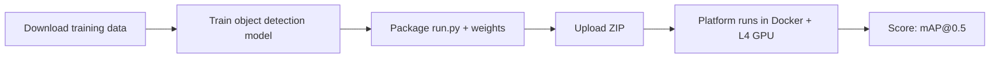

# Task 4: NorgesGruppen Data — Object Detection

**Status:** Not started
**Owner:** Unclaimed (whoever finishes first)
**Submission:** Code upload (ZIP)

## Overview

Object detection on 254 Norwegian grocery shelf images with ~22k COCO annotations and 357 product categories.

## Key Details

- Train locally, upload `.zip` with `run.py` + weights
- Runs in sandboxed Docker with GPU (NVIDIA L4, 24GB VRAM)
- Score: 70% detection + 30% classification (mAP@0.5)
- Download training data from submit page (login required)

## Architecture

## Approach

- YOLOv8 or RT-DETR for fast training + inference
- COCO format annotations → standard detection pipeline
- Fine-tune pre-trained model on grocery shelf data
- 357 categories is a lot — may need to group or use larger model

## Scores

TBD
